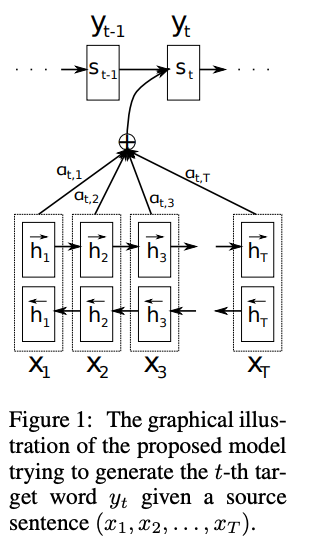

We all have a dream that our powerful AI models could learn by themselves, update and improve themselves from their daily tasks (i.e. input). Humans can naturally do that. Actually, we have no choice but updating our memory every second and we haven't found a way to reset ourselves to a moment in the past (Creating time machine is not discussed in this post). Comparing AI with Humans, many believe, including myself, that the future of AI models should continually learn at test time without waiting to be retrained once in a while.
That said, we need continual learning and memory in our AI models.

## Model Hidden State as Memory
The term "memory" in neural networks is not new: RNN has used the hidden state as a form of memory which was carried over to new timesteps (which we now call tokens). The following work Long Short-Term Memory ([LSTM](https://deeplearning.cs.cmu.edu/S23/document/readings/LSTM.pdf)) directly uses the term "memory" to refer to the hidden state.

At a high level, we can regard the memory update as $c_t=F(x_t, c_{t-1})$, where $c_t$ and $c_{t-1}$ are the memory at timestep $t$ and $t-1$ respectively, and $x_t$ is the input at timestep $t$. 

In theory, the memory in RNN and LSTM can be carried over forever, from previous tasks to new tasks. Aha! We had continual learning language models more than 30 years ago.

However, it has two issues in practice: (1) the fixed-length hidden vector as memory can be overloaded and is not able to store all information about the past, and (2) after a memory is forgotten via the forgetting mechanism in LSTM, the memory can never be used again in the future. 

## Attention-based Memory

In the first modern attention [paper](https://arxiv.org/pdf/1409.0473), it proposed to keep the hidden vectors of all the encoding tokens, and use attention to search over them during decoding for machine translation. (It is an encoder-decoder framework, different from the current decoder-only LLMs.) The RNN + Attention architecture utilizes two types of memories: The RNN hidden state which is a fixed-size vector, and the activations of encoding tokens, whose size is linear to the input length. The attention was already very similar to our familiar attention in [Transformers](https://arxiv.org/pdf/1706.03762), which serves as the only working memory of the model. 

## External Vectors as Memory

Concurrent to the rise of attention in machine translation, some work regards the memory in neural models more like computer memory. Computer memory serves as an external component and the CPU can read and write (including overwrite) the memory. Following this philosophy, [Memory Networks](https://arxiv.org/pdf/1410.3916) and [Neural Turing Machines](https://arxiv.org/pdf/1410.5401) use a more flexible mechanism to store past knowledge compared to attention.
This external memory is more flexible compared to the attention-based memory, since attention requires storing the same length of vectors for every timestep which is not flexible or might not be necessary.
The memory is a set of vectors $\mathbb{R}^{d \times N}$

With the fast development of pretraining models, such as GPT and BERT, transformer's attention-based memory became the only dominant memory due to its outstanding performance and the ability to scale. Although keeping the activations in all timesteps surely can maintain a lot of information when it increases linearly proportional to the input length. From the perspective of reducing the cost in quadratic attention, many works revisit the attention mechanism, including [Linear Attention](https://arxiv.org/pdf/2006.16236).
The memory is a matrix $\mathbb{R}^{d \times d}$

## Model Parameters as Memory
Till now, we may think that the attention-based memory works so well, we shouldn't remove it for short sequences. We just need to find some alternative memory representation for longer context dependency. The external vectors sound like a good option here. If a matrix can serve as the memory, then a more powerful architecture can do it as well.

[Titans](https://arxiv.org/pdf/2501.00663) proposed to use MLP layers to serve as memory: $M_t = f(M_{t-1}, x_t)$. Aha, is it the same as RNN models? So we come full circle? We will discuss this in [The learning of Memory](#the-learning-of-memory).
[Memory layer at Scale](https://arxiv.org/pdf/2412.09764) uses a sparse layer as the memory. Different from matrix multiplication, it adapts the sparse nature of memory where only a few memory pieces need to be retrieved at a time while others do not need to contribute to the decision. The follow-up [paper](https://arxiv.org/pdf/2510.15103) extends this architecture to continual learning.

## The learning of Memory

Now we may raise these questions: Are all these memory architectures the same fundamentally? After all, they can all be represented as $M_t = f(M_{t-1}, x_t)$. Well, the answer might be yes and no. The key difference is how the memory is trained.

The parameters in attention-based memory and external vectors are trained to optimize the task loss, e.g., the loss of next token prediction in LLM pretraining.
Titans trains the memory MLP in a meta-learning fashion (at test time, the model updates its memory parameters based on the input sequence without traditional backpropagation through the entire training corpus).

## Reference

[Long Short-Term Memory](https://deeplearning.cs.cmu.edu/S23/document/readings/LSTM.pdf)

[Neural Machine Translation by Jointly Learning to Align and Translate](https://arxiv.org/pdf/1409.0473)

[Titans: Learning to Memorize at Test Time](https://arxiv.org/pdf/2501.00663)

[Memory Networks](https://arxiv.org/pdf/1410.3916)

[Neural Turing Machines](https://arxiv.org/pdf/1410.5401)

[Memory layer at Scale](https://arxiv.org/pdf/2412.09764)